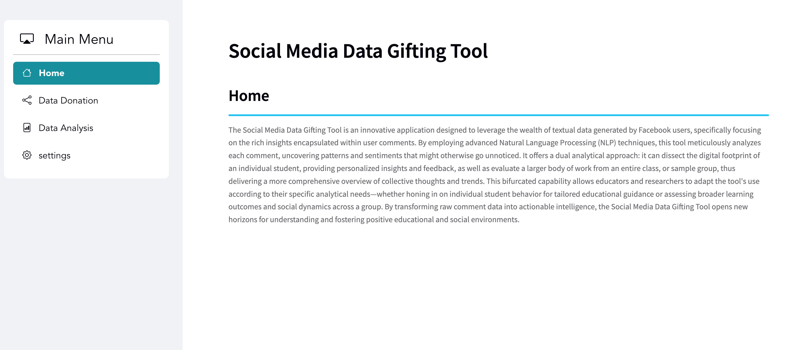
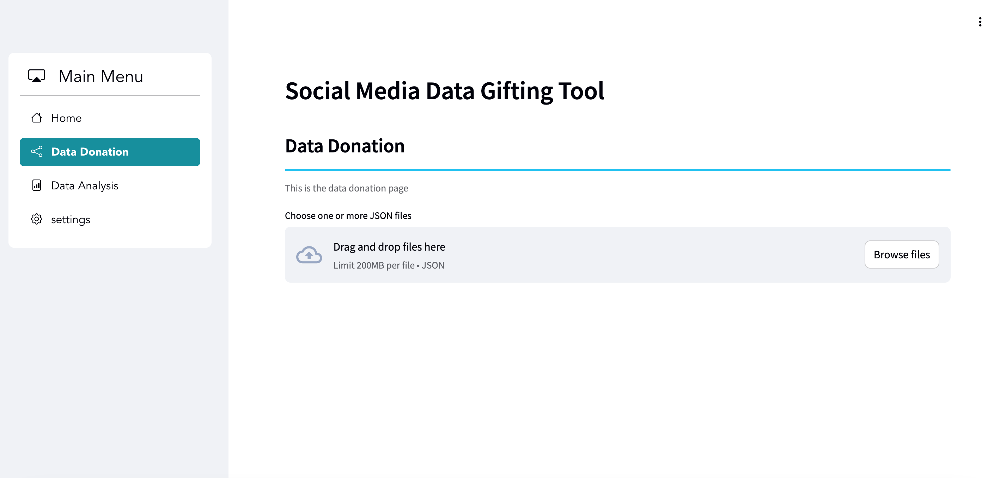
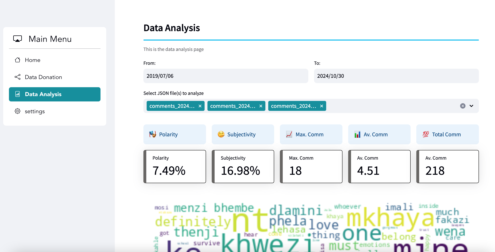

# Social Media Data Gifting App : Description

The Social Media Data Gifting Tool is an innovative application designed to leverage the wealth of textual data generated by Facebook users, specifically focusing on the rich insights encapsulated within user comments. By employing advanced Natural Language Processing (NLP) techniques, this tool meticulously analyzes each comment, uncovering patterns and sentiments that might otherwise go unnoticed. It offers a dual analytical approach: it can dissect the digital footprint of an individual student, providing personalized insights and feedback, as well as evaluate a larger body of work from an entire class, or sample group, thus delivering a more comprehensive overview of collective thoughts and trends. This bifurcated capability allows educators and researchers to adapt the tool's use according to their specific analytical needs—whether honing in on individual student behavior for tailored educational guidance or assessing broader learning outcomes and social dynamics across a group. By transforming raw comment data into actionable intelligence, the Social Media Data Gifting Tool opens new horizons for understanding and fostering positive educational and social environments.

<!-- ## Features

- Generate anonymous posts and comments data.
- [Placeholder for Feature 2]
- [Placeholder for Feature 3] -->

## How it looks

# Home Screen



# Share Data



# Analyse Shared Data



## Installation

1. **Clone the repository:**

   ```bash
   git clone <repository_url>
   ```

2. **Install dependencies:**

   ```bash
   !pip install -r requirements.txt
   ```

## Running the app

1. **Navigate to the project directory:**

   ```bash
   cd <project_directory>
   ```

2. **Run the app:**
   ```bash
   streamlit run app.py & npx localtunnel --port 8501
   ```
   This will start the Streamlit app and create a public URL using `localtunnel` that you can access in your browser.

## Prerequisites

- Python 3.x
- Node.js (for localtunnel)

## App Usage

The app will allow you to generate analytics ob Facebook comments shared by as particular user. Multiple comment files (in json format) can also be analysed in parallel.

## Contributing

Feel free to contribute to this project!
